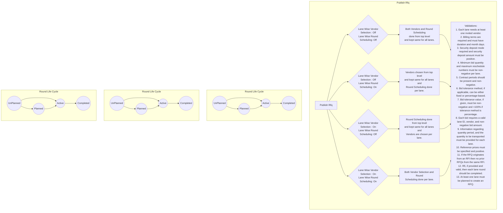

```mermaid

flowchart 
    subgraph Publish Rfq
        id1[Publish Rfq]-->id2{Lane Wise Vendor<br/>Selection : Off<br/>Lane Wise Round<br/>Scheduling: Off}
        id1-->id3{Lane Wise Vendor<br/>Selection : Off<br/>Lane Wise Round<br/>Scheduling: On}
        id1-->id4{Lane Wise Vendor<br/>Selection : On<br/>Lane Wise Round<br/>Scheduling: Off}
        id1-->id5{Lane Wise Vendor<br/>Selection : On<br/>Lane Wise Round<br/>Scheduling: On}
        newLines["` Validations:
                1. Each lane needs at least one invited vendor.
                2. Billing terms are required and must have duration and month days.
                3. Security deposit mode required and security deposit amount must be positive.
                4. Minimum bid quantity and maximum reschedule numbers must be non-negative per lane.
                5. Contract periods should be present and non-negative.
                6. Bid tolerance method, if applicable, can be either fixed or percentage-based.
                7. Bid tolerance value, if given, must be non-negative and <100% if tolerance method is percentage.
                8. Each bid requires a valid lane ID, vendor, and non-negative bid amount.
                9. Information regarding quantity period, and the quantity to be transported must be provided for each lane.
                10. Reference prices must be specified and positive.
                11. If the RFQ originates from an RFI then no prior RFQs from the same RFI.
                12. Rfi, if provided and valid, then each lane round should be completed.
                13. At least one lane must be planned to create an RFQ.
        `"]
        id2-->id2'[Both Vendors and Round Scheduling<br/>done from top level<br/>and kept same for all lanes.]
        id3-->id3'[Vendors chosen from top level<br/>and kept same for all lanes and<br/>Round Scheduling done per lane.]
        id4-->id4'[Round Scheduling done from top level<br/>and kept same for all lanes and<br/>Vendors are chosen per lane.]
        id5-->id5'[Both Vendor Selection and Round<br/>Scheduling done per lane.]
        id2'-->newLines
        id3'-->newLines
        id4'-->newLines
        id5'-->newLines
    end
    subgraph Round Life Cycle
        id_1((UnPlanned))-->id_2((Planned))
        id_1-->id_3((Active))
        id_2-->id_3
        id_3-->id_4((Completed))
    end
    subgraph Round Life Cycle
        id_`1((UnPlanned))-->id_`2((Planned))
        id_`1-->id_`3((Active))
        id_`2-->id_`3
        id_`3-->id_`4((Completed))
    end
    subgraph Round Life Cycle
        id_``1((UnPlanned))-->id_``2((Planned))
        id_``1-->id_``3((Active))
        id_``2-->id_``3
        id_``3-->id_``4((Completed))
    end
    
```
